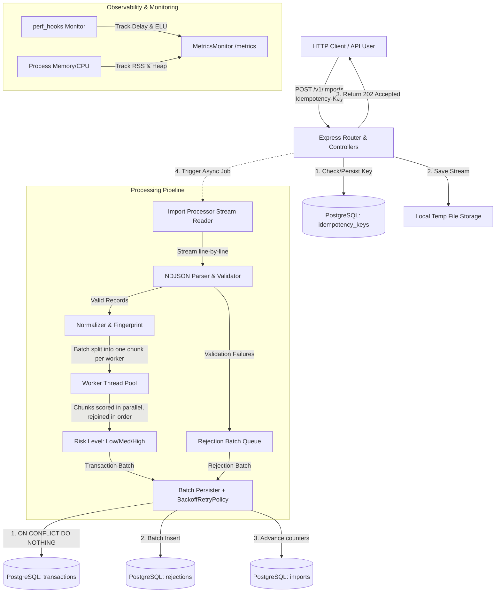

# Architecture Documentation

Comprehensive architectural design for the **High-Throughput Transaction Import and Reconciliation Service**.

## System Architecture Diagram

---

## 1. System Components & Module Boundaries

- **Presentation Layer (`src/presentation/`)**: Express controllers, routes, request validation, Multer file upload stream handling, and structured JSON error handling.
- **Application Layer (`src/application/`)**: Use cases (`CreateImport`, `GetImportStatus`, `CancelImport`, `GetSummary`, `GetRejections`) and background streaming job processor (`ImportProcessor`).
- **Domain Layer (`src/domain/`)**: Repository abstractions (`IImportRepository`, `ITransactionRepository`, `IRejectionRepository`), entities, domain validators, normalizers, fingerprint calculators, and risk scoring logic.
- **Infrastructure Layer (`src/infrastructure/`)**: Drizzle ORM PostgreSQL repositories, local file storage, worker thread pool, Pino logger, Prometheus metrics monitor, retry policy, and job recovery.

---

## 2. Key Strategies & Mechanisms

### Backpressure & Bounded Concurrency
- **Stream Backpressure**: The parser consumes the file with `for await (const line of rl)`. The async iterator stops pulling while the loop body is awaiting risk scoring and the database write, and readline in turn pauses the underlying file stream once its internal buffer fills. Resident memory is therefore bounded by one batch plus that buffer, regardless of file size. Measured read-ahead stays at ~0.4MB even when a batch stalls for 250ms, and peak heap is flat at ~82MB across both a 72MB and a 216MB file.
- **Active Import Concurrency**: `ImportJobQueue` is the single owner of how many imports run at once, capped at `MAX_ACTIVE_IMPORTS` (default: 2). The processor holds no limiter of its own — a second limit downstream of the queue could only block an already-admitted job, which would occupy a queue slot while doing no work and make the queue's own bound meaningless.
- **Queue Bound**: `MAX_PENDING_IMPORTS` (default: 20) reserves capacity before file persistence. When full, the API returns `429 IMPORT_QUEUE_FULL`; uploads are never placed in an unbounded promise queue.

### Idempotency & Duplicate Prevention
- **Import Creation Idempotency**: DB table `idempotency_keys` with unique primary key `key`. A PostgreSQL transaction-scoped advisory lock keyed by `Idempotency-Key` makes the check/create sequence safe under concurrent requests.
- **Transaction Duplicate Prevention**: PostgreSQL unique index `UNIQUE (provider_id, transaction_id)` enforces duplicate prevention across files, imports, process restarts, and concurrent workers using `ON CONFLICT DO NOTHING`.

### Upload Validation
- **The filename and the client MIME type are never the basis for acceptance.** The `.ndjson` extension check in the multer `fileFilter` is only a cheap early gate that avoids spooling an obviously wrong 500MB body to disk; it is not the security boundary.
- The authoritative check is on content: after the upload lands on disk, the first 64KB are read and `NdjsonSniffer` requires the first non-blank line (after any byte order mark) to parse as a JSON **object**. This rejects a renamed archive, a CSV, a JSON array, pretty-printed JSON, and an empty file, all of which pass an extension check. Content holding a NUL byte is rejected outright as binary.
- A first record larger than the 64KB window is accepted and left to per-line validation, so a legitimately long record is rejected as one bad line rather than failing the whole import.
- **The MIME type is deliberately not checked at all.** An allowlist would be trivially satisfied by an attacker setting the header, while rejecting honest clients: `curl -F "file=@data.ndjson"` sends `application/octet-stream`. It would add no security and break the most common upload path.
- Request shape is bounded independently of content: multer caps `fileSize`, `files: 1`, `fields: 5`, and `parts: 10`, and the JSON and urlencoded body parsers are capped at 1MB. Each limit maps to a distinct client error — `TOO_MANY_FILES`, `UNEXPECTED_FILE_FIELD`, `TOO_MANY_PARTS`, `TOO_MANY_FIELDS`, `IMPORT_FILE_TOO_LARGE`, `REQUEST_BODY_TOO_LARGE` — rather than surfacing as a 500.
- Rejected uploads return `400 INVALID_FILE_TYPE`, and the staged temp file is removed in the request's `finally` block, so a rejected upload leaves nothing on disk.
- Path traversal is not reachable from the filename: multer names the staged file itself, and `LocalFileStorage` names the stored file from the generated import id, so `originalname` never reaches a filesystem path.

### Off-Event-Loop Risk Scoring
- CPU-intensive risk calculation (a multi-round crypto hashing loop) runs on a fixed pool of Node `worker_threads` (`src/infrastructure/workers/worker-pool.ts`), so the HTTP event loop is never occupied by scoring.
- **Risk score composition** is deterministic and capped at 100: amount contributes 0–35 points using logarithmic scaling (saturating at $10,000), description length contributes 0–15, overnight hours (00:00–05:00 UTC) contribute 25 otherwise 5, the merchant hash contributes 0–15, and the final SHA-256 digest contributes 0–10 fingerprint points. The fingerprint is therefore both a deduplication input and a scoring signal; the 500 hashing rounds are not discarded CPU work.
- **Each batch is split into one chunk per worker** and the chunks are enqueued as independent tasks, so the whole pool works on one batch. Sending a whole batch to a single worker would leave every other worker idle and make the pool decorative. Chunks are contiguous slices re-joined in order, because the processor pairs results to records positionally.
- **The speedup is real but sublinear**: measured 1,769 → ~3,000 records/sec (≈1.7×) on an 8-core Apple M1, plateauing from three workers upward. Scoring is a tight SHA-256 loop, so throughput is bounded by the fast physical cores, not the thread count — a batch finishes only when its slowest chunk does, and extra chunks land on slower cores. `WORKER_CONCURRENCY` defaults to 4 and should be measured per machine rather than derived from the core count.
- **A worker that errors is removed from the pool** and its task rejected, so a broken worker is not handed further work. There is no per-task timeout: a worker that hangs rather than erroring holds its chunk indefinitely.
- If the pool could not be created at all, scoring falls back to the main thread so imports still complete. This degrades API latency and is not currently surfaced as its own metric.

### Retry Policy & Error Classification
- The `IRetryPolicy` port (`src/domain/retry/retry-policy.interface.ts`) is implemented by `BackoffRetryPolicy` and injected into `DrizzleImportBatchPersister`, wrapping **batch persistence** — the one operation with a genuine transient failure mode (connection drops, deadlocks, serialization failures). Attempts are capped (`RETRY_MAX_ATTEMPTS`, default 4), backoff is exponential with full jitter so concurrent failures do not re-converge on the same retry instant, and every retry is logged with `operationName`, `retryAttempt`, `delayMs`, and `errorCode` and counted in `app_retry_attempts_total`.
- **The retried unit is a single database transaction.** `persist()` writes the transaction rows, the rejection rows, and the counter increments inside one `BEGIN`/`COMMIT`. A failed attempt therefore rolls back completely and leaves nothing behind for the next attempt to trip over, and the transaction insert itself is guarded by `ON CONFLICT DO NOTHING` on `(provider_id, transaction_id)`.
- **Known gap — the ambiguous commit.** If PostgreSQL commits but the acknowledgement is lost (connection reset at exactly the wrong moment), a retry re-applies the counter increments and re-inserts the rejection rows, which carry no unique constraint. Transaction rows are still protected by the unique index, so the ledger stays correct, but progress counters can overcount for that batch. Closing this needs a batch-level claim key — an `import_batches` row keyed by `(import_id, batch_number)` written in the same transaction — which is not implemented. The delivery guarantee today is therefore **at-least-once for counters, effectively-once for accepted transactions**.
- **Never retried**: validation failures, duplicate records, constraint violations (`23505`, `23503`), cancellations, and programming errors (`TypeError`, `SyntaxError`). These are deterministic — another attempt produces the same failure and only burns capacity. Validation happens before persistence, so a bad record can never reach the retry path.
- **Retry storms** are avoided by the attempt cap, the jittered backoff, and the bounded import queue upstream: a struggling database cannot be met with unbounded concurrent retries.
- **After the final attempt** the error propagates out of `persist()` to `ImportProcessor`, which marks the import `failed` with a non-sensitive reason and logs `import_failed` with the error. The raw error stays in the logs and never reaches the client.
- Retries are **cancellable**: the policy accepts an `AbortSignal`, stops retrying once it is aborted, and interrupts the backoff sleep. The composition root wires this to the shutdown controller, so `SIGTERM` does not wait out a long backoff.

### Graceful Shutdown & Job Recovery
On `SIGTERM` or `SIGINT` the process, in order: stops accepting new imports and fails readiness (so a load balancer drains it) → signals in-flight imports to stop at their **next batch boundary** → closes the HTTP server → drains the import queue → drains and terminates the worker pool → closes the database pool → flushes logs and exits.

- **The batch currently being written always commits.** Shutdown only prevents the *next* batch from starting; it never aborts an open database transaction, so the ledger and the counters stay consistent.
- **Grace period**: `SHUTDOWN_GRACE_PERIOD_MS` (default 30s). If it expires, the process logs at error level and exits non-zero with work still in flight. Those imports are left in `processing` and are picked up by `JobRecoveryService` on the next start.
- **Cancellation vs. shutdown** are deliberately different: cancellation is a user decision about one import and terminates it as `cancelled`, retaining everything committed before the checkpoint; shutdown is an operational event affecting every import and terminates them as `failed`, so they are visible as unfinished rather than silently marked done.
- **Imports are owned by a lease, not by the process that happens to be running.** Claiming an import stamps `owner_id` (a per-process id), sets `lease_expires_at` to now + `JOB_LEASE_TTL_MS` (default 60s), and increments `attempts`. `JobRecoveryService` only reclaims imports whose lease has lapsed, so a second instance starting up marks a crashed instance's work `failed` (or `cancelled`) while leaving a live instance's in-flight import untouched. Without the lease, any starting process would fail every in-flight import in the fleet.
- **The batch commit is the heartbeat.** The batch persister already updates the `imports` row to advance counters, so it extends `lease_expires_at` in that same statement — no timer, no extra query, and the renewal happens inside the transaction that proves the worker is alive. A TTL well above the worst-case batch time keeps a slow batch from losing its own lease.
- Completing an import clears `owner_id` and `lease_expires_at`. Graceful shutdown expires this instance's leases on the way out, so a planned restart reclaims immediately instead of waiting out the TTL. The `(status, lease_expires_at)` index keeps the recovery scan off a sequential scan.

### Structured Logging
- A single `ILogger` port (`src/domain/logging/logger.interface.ts`) is implemented by a Pino adapter and injected from the composition root; no module constructs its own logger. Components default to a silent logger so tests stay quiet.
- Every HTTP request gets a correlation id — an inbound `X-Request-Id` is honoured only when it matches a short safe-character pattern, otherwise one is generated — which is echoed in the response header, attached to the request's child logger, and returned in every error envelope. Every field is JSON-encoded, so untrusted input cannot forge a log line.
- The processor binds `importId` and `providerId` to a child logger for the life of an import; batch records add `batchNumber`, `recordCount`, and `durationMs`, and shutdown records add `signal` and `shutdownState`.
- Transaction descriptions and raw rejected values are redacted at the root logger, so no child can leak them.

### API Documentation
- An OpenAPI 3.0 document is served as Swagger UI at `/docs`, and `/` redirects there. The document is a typed object compiled into the bundle rather than a YAML asset, so it needs no extra copy step in the Dockerfile and cannot drift out of the build.
