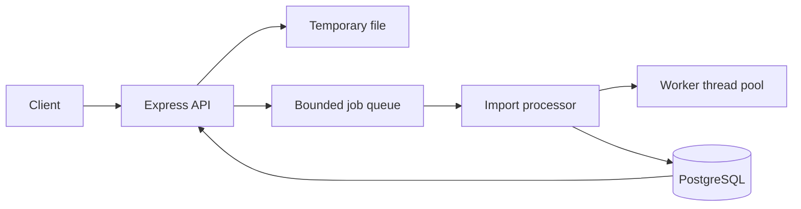

# Architecture

## Overview

The service has four main parts:

- `presentation`: HTTP routes, uploads, errors, and OpenAPI.
- `application`: use cases, the import processor, and the in-memory job queue.
- `domain`: validation, normalization, fingerprints, risk scoring, and interfaces.
- `infrastructure`: PostgreSQL repositories, file storage, worker threads, logging, metrics, retries, and recovery.

`src/index.ts` wires the concrete infrastructure into the application. Business code uses interfaces instead of constructing database clients or other infrastructure directly.

## Dependency direction and injection

The domain defines interfaces for repositories, storage, workers, logging, metrics, clocks, ids, and retries. Infrastructure implements those interfaces. `src/index.ts` creates the concrete implementations and passes them into the use cases and processor. This keeps the application code independent of Express, Drizzle, and the filesystem.



## Import flow

```text
HTTP upload
  -> temporary file
  -> import row and queue entry
  -> line-by-line parsing
  -> validation and normalization
  -> fingerprint and risk score
  -> batch database transaction
  -> status and summary endpoints
```

The file is never loaded into memory all at once. The processor waits at batch boundaries, which provides backpressure. The queue limits the number of active and pending imports.

The queue rejects new work with `429` when it is full. The line reader pauses naturally while a batch is being scored and written.

## Database

The main tables are:

- `imports`: status, progress, lease data, and failure information.
- `idempotency_keys`: maps an idempotency key to an import.
- `transactions`: accepted transactions and risk results.
- `rejections`: invalid or rejected input lines.

Important constraints and indexes:

- Primary keys identify all records.
- Foreign keys connect transactions and rejections to imports.
- `UNIQUE (provider_id, transaction_id)` prevents duplicate accepted transactions.
- Import, currency, risk, and rejection indexes support common reads.
- Rejections use cursor pagination by line number.

Import creation uses a PostgreSQL advisory lock so two requests with the same idempotency key cannot create two imports.

## Concurrency and risk scoring

Risk scoring runs in a reusable worker-thread pool. Each batch is split into chunks and sent to available workers. Results are joined in the original order.

The score is deterministic and has these parts:

- amount: 0-35 points, using logarithmic scaling
- description length: 0-15 points
- transaction hour: 25 points for 00:00-05:00 UTC, otherwise 5
- merchant id: 0-15 points
- final fingerprint digest: 0-10 points

The final score is capped at 100. Risk levels are low from 0-39, medium from 40-69, and high from 70-100.

## Persistence and retries

Each batch writes transactions, rejections, and import counters in one database transaction.

Database batch writes retry temporary failures with:

- a maximum attempt count
- exponential backoff
- jitter
- error classification
- logging and metrics
- shutdown cancellation

Validation failures, duplicates, cancellations, constraint errors, and programming errors are not retried.

## Cancellation

Cancellation changes an active import to `cancelling`. The processor checks that state at batch boundaries, finishes the current database transaction, and then stops. Rows already committed remain in the database. The final status becomes `cancelled`.

## Duplicate handling

The database uses first-write-wins for `(provider_id, transaction_id)`. The unique constraint prevents the later row from replacing the original.

Duplicate handling is first-write-wins. An identical replay is counted as a duplicate. If the same transaction id has a different fingerprint, the stored row is kept and the incoming row is recorded in `rejections` with reason `DUPLICATE_CONTENT_MISMATCH`.

## Job recovery

Each process has an owner id. When an import starts, it gets:

- an owner id
- a lease expiry time
- an attempt count

The batch persister extends the lease when it commits a batch. On startup, only processing jobs whose lease has expired are treated as stale. A live job on another instance is not failed just because a new instance starts.

This is only the lease foundation. Updates to progress and final status do not yet check the owner, so a stale worker could still write after its lease expires. Full multi-instance safety needs owner-token or fencing checks on every job update.

If a process stops during an import, the database transaction either commits or rolls back. After the lease expires, the job is identified as stale. Import-level redelivery is not enabled yet, so the current policy marks stale work as failed instead of replaying the file.

## Event-loop protection

Risk scoring runs in worker threads, not on the HTTP event loop. File parsing and database writes are still performed by the main process, but they are streamed, batched, and bounded. The metrics endpoint reports event-loop delay and utilization.

## Shutdown

On `SIGTERM` or `SIGINT`, the service:

1. stops accepting new imports
2. marks readiness as failed
3. stops taking new queue work
4. lets the current batch finish when possible
5. closes the HTTP server, workers, and database
6. expires its owned leases

If the process stops during a batch, the lease eventually expires and the job can be identified as stale.

## Summary responses

Currency and risk-level summaries are complete. Merchant and account summaries return the top 100 groups, ordered by total amount, transaction count, and identifier. This keeps response size bounded. A separate paginated endpoint or precomputed summary tables can be added if full group listings are needed.

## Current limitations

- The queue is local to one process. Multiple replicas need a shared queue or PostgreSQL job polling.
- Uploads are stored on the local filesystem. Multiple replicas need shared object storage.
- Lease ownership is not yet enforced on progress and completion writes.
- Import-level retry and redelivery are not implemented. Failed imports are marked failed and temporary files are removed.
- A retry after an ambiguous database commit can overcount progress counters. Batch claim records would fix this.
